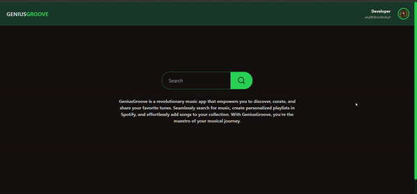

# GeniusGroove

GeniusGroove is a Single Page Web Application (SPA) that enables you to explore the Spotify library, create personalized playlists, and save them directly to your Spotify account. Whether you want to curate your favorite songs, discover new tracks, or share your musical tastes with the world, GeniusGroove has got you covered.

## Technologies Used

- **React.js**: A powerful JavaScript library for building user interfaces.
- **JavaScript**: The backbone of web development, used for adding interactivity and functionality.
- **HTML**: The standard markup language for creating web pages.
- **Tailwind CSS**: A utility-first CSS framework for rapid and responsive web development.
- **Daisy UI**: Component library for Tailwind CSS.
- **React Hot Toast**: Package for creating notification components.
- **Git and GitHub**: Version control and collaborative platform for code management.
- **Spotify API**: Integrating Spotify's API to access the vast music library and manage playlists.

## Features

GeniusGroove offers the following features:

- **Spotify Integration**: Seamlessly connect to your Spotify account to access your playlists, discover new music, and manage your tracks.
- **Search and Explore**: Search for songs, albums, and artists within Spotify's extensive catalog.
- **Create Custom Playlists**: Compile your own playlists by adding and arranging tracks to suit your mood and preferences.
- **Save to Spotify**: Save your custom playlists directly to your Spotify account to enjoy them across all your devices.
- **Authorization**: Securely authorize access to your Spotify account using the implicit grant flow from OAuth 2.0 standards.

## Future Improvements

GeniusGroove is an evolving project, and here are some future improvements in the pipeline:

### Immediate Features to Work On

1. **Search with Enter Key**: Enable users to initiate a search by simply pressing the "Enter" key, offering a more intuitive search experience.

2. **Track Preview Samples**: Enhance the song listings by providing preview samples for each track, allowing users to preview songs before adding them to their playlists.

3. **Filter Existing Playlist Tracks**: Modify the search results to display only songs that are not already present in the user's playlist, helping to avoid duplicates in custom playlists.

4. **Loading Screen for Playlist Saving**: Implement a loading screen or progress indicator during the playlist saving process, offering a better user experience.

5. **Optimize Token Expiration Logic**: Refine the access token logic to expire at precisely the right time, instead of setting expiration from when the user initiates their next search, ensuring a more secure and reliable authorization process.

6. **Restore Search Term on Login Redirect**: When a user is redirected after login, maintain the search term from before the redirect, preserving the continuity of their search.

7. **Persistent Playlist Information**: Ensure that playlist information doesn't get cleared, even if a user has to refresh their access token. This guarantees a seamless playlist management experience.

8. **Fetch Existing Playlists**: Add functionality for users to fetch and view all their existing playlists, making it easier to manage and organize their music collection.

### Necessary Improvements:

- **Enhanced Authorization**: Implement more secure forms of authorization, such as a login portal or authorization code with PKCE flow. [Learn more](https://developer.spotify.com/documentation/web-api/tutorials/code-pkce-flow)
